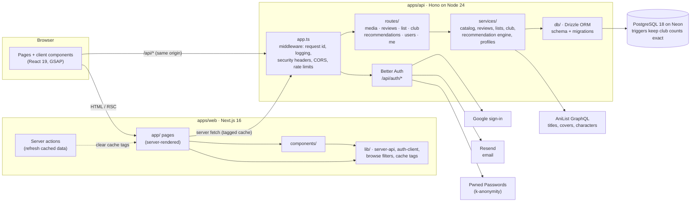

# Anime Manga Club

A full-stack website for an anime and manga club: members give titles a verdict, keep watch and reading lists, like each other's reviews, get personal suggestions that explain themselves, and see what the club leads pick each week.

> Portfolio project by Chaitanya. The source is proprietary (see [LICENSE](LICENSE)); it is shared privately for review only.

## Highlights

- **Verdicts, not numbers.** Members rate titles Skip, Timepass, Go for it or Perfection, each marked by its own colour. Each title shows the club's verdict with a semicircle gauge of how the votes split.
- **Suggestions that say why.** "For you" blends a taste profile (genres, weighted themes and preferred formats), "members with similar taste loved this", AniList and club quality, one pick per franchise, and a reason on every card ("More Attack on Titan, which you loved", "Because you like Revenge and Military stories").
- **Bring your list.** Import an AniList anime and manga list in one go; statuses and your scores feed your suggestions straight away.
- **Search that speaks Japanese titles.** "shingeki no kyoujin", "kimetsu no yaiba" or "SnK" find the English-titled entries, forgiving spelling and missing words.
- **Club leads' weekly picks**, planned ahead privately and published when the week starts.
- **Accounts done properly:** email and password or Google, email confirmation, password reset, breached-password checks, a "new sign-in" email with a way to lock an intruder out, and no way to probe who is a member.
- **Accessible and fast:** WCAG 2.2 AA checked by automated axe scans on every page; Lighthouse 100 for accessibility, best practices and SEO; 99–100 performance on desktop.

## Architecture

The website and the API run as separate apps. Browsers only ever talk to the website, which forwards `/api/*` to the API, so session cookies stay first-party.



The layering above comes from a [graphify](https://github.com/safishamsi/graphify) knowledge graph of the code (972 nodes, 2,732 links): on the API side requests flow `app → routes → services → db`, with shared helpers in `lib`; on the website, `app` pages → `components` → `lib`. No import cycles.

## Tech stack

| Layer    | Choice                                                                               |
| -------- | ------------------------------------------------------------------------------------ |
| Website  | Next.js 16 (App Router, Turbopack), React 19, Tailwind CSS 4, GSAP 3 (ScrollTrigger) |
| API      | Hono 4 on Node.js 24, Zod 4 validation, OpenAPI docs at `/api/docs`                  |
| Auth     | Better Auth 1.7 (email/password, Google, username, admin roles)                      |
| Database | PostgreSQL 18 on Neon, Drizzle ORM and drizzle-kit migrations                        |
| Email    | Resend                                                                               |
| Data     | AniList GraphQL API                                                                  |
| Tests    | Vitest 5 with in-memory PGlite, Playwright + axe-core, Lighthouse                    |
| Tooling  | TypeScript 6 (strict), ESLint 10, Prettier, npm workspaces, GitHub Actions           |

## Engineering notes

- **Security:** CSRF origin checks everywhere; open-redirect-proof `?next=` links; rate limits per IP and per member; the client IP is resolved from trusted proxies only; strict CSP on the API; breached passwords refused (and the check runs before a reset link is used up); deleting an account needs the password or a recent sign-in; public profiles and reviews never expose real names or emails.
- **Data integrity:** one review per member per title, verdicts limited to 1–4 and like counts never below zero, all enforced by the database; triggers keep each title's club totals exact even when accounts are deleted; keyset pagination with microsecond-exact cursors, so feeds never skip or repeat.
- **Caching:** public pages are cached and tagged; a member's own change (a review, a list update, a club pick, a deleted account) clears exactly the affected tags through a server action, so it shows at once. Anything personal is never cached.
- **Performance:** no 3D or heavy libraries on the page; the background characters load only on wide screens; images are optimised by Next.js; no source maps are published.
- **Accessibility:** every colour pair measured at 4.5:1 or better in both themes; reduced-motion respected by every animation; keyboard-friendly menus and forms; 24px minimum tap targets.

## Project layout

```
apps/
  api/   Hono API: src/{app,auth,env}.ts, routes/, services/, db/ (schema, migrations), lib/, middleware/, test/
  web/   Next.js website: src/app/ (pages), components/, lib/
  e2e/   Playwright end-to-end and accessibility tests
design/  An early HTML prototype of the banner
```

## Running it locally

Requirements: Node.js 24 LTS and a PostgreSQL database (a free Neon project works).

1. `npm ci`
2. Copy `.env.example` to `.env` and fill it in (database URLs, a Better Auth secret, and optionally Google and Resend keys). Without Resend, emails are printed to the API log.
3. `npm run db:migrate --workspace @amc/api`, then `npm run db:seed --workspace @amc/api` to load popular titles from AniList.
4. `npm run dev` starts the API on port 4000 and the website on http://localhost:3000.
5. To make yourself a club lead: `npm run user:set-role --workspace @amc/api -- <email or username> admin`.

## Tests and checks

| Command                                       | What it runs                                                                                                                                                              |
| --------------------------------------------- | ------------------------------------------------------------------------------------------------------------------------------------------------------------------------- |
| `npm run check`                               | Prettier, ESLint, TypeScript and 290 API tests (Vitest against in-memory PostgreSQL)                                                                                      |
| `npm run test:e2e`                            | 26 Playwright tests in a real browser: sign-up and sign-in, reviews, lists, likes, profiles, the club lead panel, the phone menu, and axe WCAG 2.2 AA scans of every page |
| `npm run db:check-drift --workspace @amc/api` | Fails if the schema and migrations disagree                                                                                                                               |

CI runs the checks, the build, the migrations and the end-to-end suite against a real PostgreSQL 18.

## Deployment

The API is set up for Fly.io in Singapore, next to the database (Docker image, migrations on each release, health checks); see [apps/api/DEPLOY.md](apps/api/DEPLOY.md). The website is headed for Vercel.

## Credits

Anime and manga data and artwork come from [AniList](https://anilist.co); characters belong to their creators and publishers. Full credits, including fonts, services and open-source libraries, are on the site's `/credits` page and in [CREDITS.md](CREDITS.md).

## Licence

Copyright © 2026 Chaitanya. All rights reserved. See [LICENSE](LICENSE).
